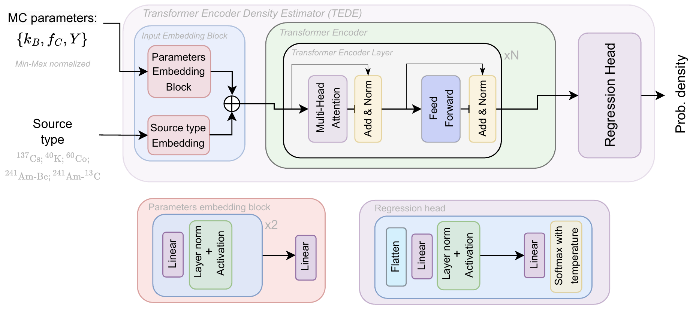

[](https://www.python.org/downloads/)
[](https://pytorch.org/)
[](https://opensource.org/licenses/MIT)

# Simulation-based inference for Precision Neutrino Physics through Neural Monte Carlo tuning

This repository contains the implementation of neural likelihood estimators for Monte Carlo parameter tuning in high-precision neutrino experiments, with a focus on the JUNO (Jiangmen Underground Neutrino Observatory) detector. The code presented here was used for our study that is available online on [arXiv](https://arxiv.org/abs/2507.23297). Please refer to the paper for details. 

## Overview

Precise modeling of detector energy response is crucial for next-generation neutrino experiments. This work develops neural likelihood estimation methods within the simulation-based inference framework to address the computational challenges arising from the lack of analytical likelihoods.

### Key features

- **Two complementary neural density estimators:**
  - **TEDE** (Transformer Encoder Density Estimator): Histogram-based binned likelihood analysis
  - **NFDE** (Normalizing Flows Density Estimator): Exact continuous probability density modeling for unbinned analysis

- **Bayesian parameter inference** using nested sampling
- **Energy response parameter tuning** for three correlated parameters: Birks' coefficient ($k_B$), light yield ($Y$), and Cherenkov factor ($f_C$)
- **Comprehensive uncertainty quantification** with additional testing datasets

<div align="center">
  <table>
    <tr>
      <td align="center"></td>
      <td align="center"></td>
    </tr>
  </table>
  <br><em>Left: TEDE Architecture. Right: NFDE transforming complex energy distributions to simple Gaussian distributions through sequential transformations.</em>
</div>


*Animation showing how normalizing flows progressively build the complex ${}^{241}$Am-${}^{13}$C energy distribution*

The NFDE model learns invertible transformations that map complex, multimodal energy spectra to simple standard normal distributions, enabling exact likelihood computation for unbinned analysis.

## Study background

### The JUNO experiment

The Jiangmen Underground Neutrino Observatory (JUNO) is a large-scale liquid scintillator neutrino detector designed to:
- Determine neutrino mass ordering
- Measure oscillation parameters with sub-percent precision
- Study various neutrino phenomena from geoneutrinos to supernovae

### Energy response modeling in large-scale neutrino detectors

The energy response in JUNO depends on three key parameters:

1. **Birks' coefficient ($k_B$)**: Models non-linear energy quenching at high ionization densities
2. **Light yield ($Y$)**: Defines scintillation photons emitted per unit energy after quenching
3. **Cherenkov light yield factor ($f_C$)**: Scales the energy-dependent yield of photons originating from Cherenkov radiation

These parameters exhibit strong correlations and non-linear behavior, making traditional MC tuning approaches computationally prohibitive.

### Neural likelihood estimation approach

Our method uses simulation-based inference to:
1. Train models on simulated calibration events
2. Learn conditional probability densities $p(x|\phi)$ where $x$ is the observed energy and $\phi$ are the parameters
3. Integrate learned likelihoods with Bayesian nested sampling for parameter inference

## Models performance

### Spectra PDF modeling accuracy


*Comparison of modeled PDFs with true energy spectra for all five calibration sources*

Both models demonstrate excellent performance in reproducing the complex energy spectra across all calibration sources.

### Parameter estimation results

|  |  |
|:---:|:---:|
| TEDE parameter inference results | NFDE parameter inference results |

*Parameter estimation performance for a representative point using TEDE (left) and NFDE (right). Corner plots show posterior distributions for energy response parameters ($k_B$, $f_C$, $Y$). Green lines indicate true values, orange stars show best-fit values. Both models successfully recover input parameters within uncertainties.*

The corner plots demonstrate that both TEDE and NFDE models achieve:
- **Accurate parameter recovery**: Best-fit values closely match true parameters
- **Well-constrained posteriors**: Tight parameter constraints from multi-source fitting
- **Comparable precision**: Both approaches yield similar uncertainty estimates

### Systematic uncertainty analysis

#### Testing Dataset 2: Statistical scaling behavior


*Aggregated parameter estimation results for TEDE (top) and NFDE (bottom) across varying statistical exposures. Shows median bias (solid lines), 1$\sigma$ widths of best-fit distributions (shaded regions), and estimated uncertainties (dashed lines). Both models exhibit near-zero systematic biases and uncertainties limited only by the statistics of the calibration data (1/$\sqrt{N}$ dependence).*

Key findings from systematic uncertainty analysis:
- **Near-zero systematic bias**: Relative deviations below 0.25% for $k_B$, 0.55% for $f_C$, and 0.02% for $Y$
- **Statistical limit**: Uncertainties follow 1/$\sqrt{N}$ purely statistical scaling
- **Consistent performance**: TEDE and NFDE yield nearly identical results

#### Testing Dataset 1: Parameter space coverage


*Performance across the entire parameter space using TEDE (top) and NFDE (bottom) for 1000 parameter combinations. Each point represents median bias over 100 fits. Both models maintain near-zero bias across the parameter space, demonstrating robust interpolation between training points.*

The analysis for the entire parameter space demonstrates:
- **Good performance**: Near-zero biases
- **Robust interpolation**: Successful parameter recovery between training grid points
- **Model stability**: Both TEDE and NFDE show similar bias patterns

## Repository structure
```
neuromct/
├── neuromct/                   # Main package
│   ├── configs/                 # Configuration files
│   ├── dataset/                 # Data loading and preprocessing
│   ├── models/                  # Models implementations
│   │   └── ml/                   # TEDE and NFDE models
│   ├── fit/                   # Parameter inference methods
│   ├── utils/                 # Utility functions
│   └── plot/                  # Visualization tools
├── scripts/                  # Training and analysis scripts
└── docs/                     # Documentation and figures 
```

## Citation

If you found this code useful for your research, please cite:

```bibtex
@article{Gavrikov:2025rps,
    author = "Gavrikov, Arsenii and Serafini, Andrea and Dolzhikov, Dmitry and others",
    title = "{Simulation-based inference for Precision Neutrino Physics through Neural Monte Carlo tuning}",
    eprint = "2507.23297",
    archivePrefix = "arXiv",
    primaryClass = "physics.data-an",
    month = "7",
    year = "2025"
}
```
## License

This project is licensed under the [MIT](https://opensource.org/license/mit/) - see the [LICENSE](LICENSE) file for details.

## Acknowledgments

We are thankful to the JUNO collaboration for the support and advice provided during the drafting of this manuscript. We are also very grateful to CNAF and JINR cloud services for providing the computing resources necessary for the simulated data production and to CloudVeneto for offering IT support and infrastructure for training the machine learning models used in this study. Arsenii Gavrikov has received funding from the European Union's Horizon 2020 research and innovation programme under the Marie Skłodowska-Curie Grant Agreement No. 101034319 and from the European Union — NextGenerationEU. Dmitry Dolzhikov is supported in the framework of the State project "Science" by the Ministry of Science and Higher Education of the Russian Federation under the contract 075-15-2024-541.
